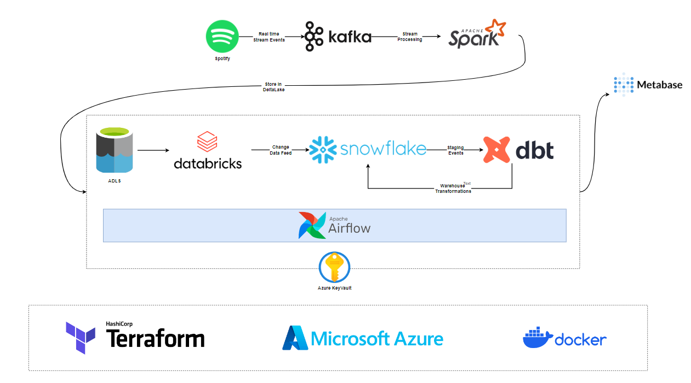

# spotify-stream-analytics
Generate synthetic Spotify music stream dataset to create dashboards. Spotify API generates fake event data emitted to Kafka. Spark consumes and processes Kafka data, saving it to the Datalake. Airflow orchestrates the pipeline. dbt moves data to Snowflake, transforms it, and creates dashboards.

# Dataset Simulation

- **Songs**: Leveraged Spotify API to create artists and tracks data, extracted from set of playlists. Each track includes title, artist, album, ID, release date, etc.
- **Users**: Created users demographics data with randomized first/last names, gender and location details.
- **Interactions**: Real-time-like listening data linking users to songs they "listened."

Feel free to explore and analyze the datasets included in this repository to uncover patterns, trends, and valuable insights in the realm of music and user interactions. If you have any questions or need further information about the dataset, please refer to the documentation provided or reach out to the project contributors.

# Tools & Technologies
- Cloud - **[Azure](https://azure.microsoft.com/en-us/)**
- Infrastructure as Code software - **[Terraform](https://www.terraform.io/)**
- Containerization - **[Docker](https://www.docker.com/)**, **[Docker Compose](https://docs.docker.com/compose/)**
- Secrets Manager - **[Azure Kevy Vault](https://azure.microsoft.com/en-in/products/key-vault)**
- Stream Processing - **[Apache kafka](https://kafka.apache.org/)**, **[Spark Streaming](https://spark.apache.org/docs/latest/streaming-programming-guide.html)**
- Data Processing - **[Databricks](https://www.databricks.com/)**
- Data Warehouse  - **[Snowflake](https://www.snowflake.com/en/)**
- Pipeline Orchestration - **[Apache Airflow](https://airflow.apache.org/)**
- Warehouse Transformation **[dbt](https://www.getdbt.com/)**
- Data Visualization - **[Metabase](https://www.metabase.com/)**
- Language - **[Python](https://www.python.org/)**

# Architecture

# Final Result

# Project Flow

- Setup Free Azure account & Azure Keyvault - **[Setup](https://github.com/abdkumar/spotify-stream-analytics/blob/main/setup/azure.md)**
- Setup Terraform and create resources - **[Setup](https://github.com/abdkumar/spotify-stream-analytics/blob/main/setup/terraform.md)**
- SSH into VM (kafka-vm) and Setup Kafka Server - **[Setup](https://github.com/abdkumar/spotify-stream-analytics/blob/main/setup/kafka.md)**
- Setup Spotify API account & Generate Spotify Stream Events Data - **[Setup](https://github.com/abdkumar/spotify-stream-analytics/blob/main/setup/data.md)**
- Setup Spark streaming job - **[Setup](https://github.com/abdkumar/spotify-stream-analytics/blob/main/setup/spark.md)**
- Setup Snowflake Warehouse - **[Setup](https://github.com/abdkumar/spotify-stream-analytics/blob/main/setup/snowflake.md)**
- Setup Databricks Workspace & CDC (Change Data Capture) job - **[Setup](https://github.com/abdkumar/spotify-stream-analytics/blob/main/setup/databricks.md)**
- SSH into another VM (airflow-vm)
  - Setup dbt models - **[Setup](https://github.com/abdkumar/spotify-stream-analytics/blob/main/setup/dbt.md)**
  - Setup airflow - **[Setup](https://github.com/abdkumar/spotify-stream-analytics/blob/main/setup/airflow.md)**

# How can I make this better?!
A lot can still be done :).

- Choose managed Infra
  - Confluent Cloud for Kafka
- Write data quality tests
- Include CI/CD
- Add more visualizations

