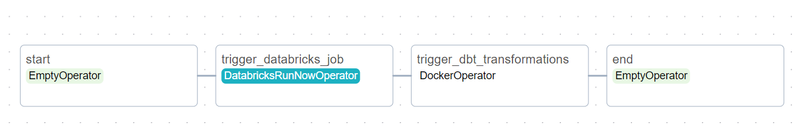

# Setting Up Airflow for Spotify Stream Analytics

This document guides you through setting up Airflow for orchestrating your Spotify stream analytics pipeline.


## Choosing the Right Airflow Setup:

- The [default Airflow Docker Compose](https://airflow.apache.org/docs/apache-airflow/stable/howto/docker-compose/index.html#fetching-docker-compose-yaml) file uses Celery executor and additional components, requiring significant resources.
- We've created a custom Docker Compose file optimized for local use with a local executor, reducing resource footprint.
- Find the custom file here: [lightweight airflow](https://github.com/abdkumar/spotify-stream-analytics/blob/main/airflow/docker-compose.yml)


**[Reference](https://medium.com/@alexroperez4/docker-airflow-gcp-80ef9280fbd3)**

### Docker Communication issues with Airflow:

- Airflow needs to access Docker images and communicate with the Docker daemon.
- Mounting `/var/run/docker.sock` directly in the Docker Compose file requires **[insecure permissions](https://stackoverflow.com/questions/51342810/how-to-fix-dial-unix-var-run-docker-sock-connect-permission-denied-when-gro)**.
- We use the `tecnativa/docker-socket-proxy` image to securely establish communication between Airflow and Docker (see file mentioned above).

**Image: [tecnativa/docker-socket-proxy](https://hub.docker.com/r/tecnativa/docker-socket-proxy)** <br>
**[Docker Proxy Setup reference](https://medium.com/@benjcabalonajr_56579/using-docker-operator-on-airflow-running-inside-a-docker-container-7df5286daaa5)**

### Accessing Keyvault for Credentials:

- Airflow accesses Snowflake and Databricks connections stored in Azure Keyvault.
- Follow the instructions provided [here](https://github.com/abdkumar/spotify-stream-analytics/blob/main/setup/azure.md#create-app-using-app-registrations) to set up credentials in Keyvault.
- Update the `.env` file in the Airflow directory with tenant_id, client_secret, and client_id retrieved from Keyvault.
- Make sure snowflake & databrcks related credentials are set in Azure keyvault.

## Orchestrating the Pipeline:

The airflow cdc_snowflake DAG orchestrates your pipeline in two steps:
- **Change Data Capture (CDC)**: Using a Databricks job, ingest changed records from Spotify into Snowflake.
- **dbt Transformations**: Run dbt transformations on the loaded data hourly.

# Running the Airflow Environment:
### 1. Initialize Airflow:

- Establish SSH connection
SSH into the VM (`airflow-vm`) using username and public ip address
```bash
ssh user@ipaddress
```

```bash
cd ~/spotify-stream-analytics/airflow
docker compose up airflow-init
```
### 2. Start all services:
```bash
cd ~/spotify-stream-analytics/airflow
docker compose up -d
```

### 3. Access the Airflow UI:
- Wait 2-3 minutes for the web server to load.
- Access `http://<VM PUBLIC IP ADDRESS>:8080`
- Login with default airflow credentials 
```
username: airflow
password: airflow
```
- Check the DAGs:
- Click on `DAGS` and look for "`cdc_snowflake`" dag.
- This DAG runs the Databricks job followed by dbt transformations on an hourly basis.



## Useful links
- [settings azure keyvault secrets backend](https://learn.microsoft.com/en-us/azure/data-factory/enable-azure-key-vault-for-managed-airflow)

- [optimal use of secret manager](https://medium.com/apache-airflow/setting-up-aws-secrets-backends-with-airflow-in-a-cost-effective-way-dac2d2c43f13)

- [top level code issues in airflow](https://medium.com/apache-airflow/avoiding-the-pitfalls-of-top-level-dag-code-fa480d9e75c6)

- [caching of airflow variables](https://marclamberti.com/blog/variables-with-apache-airflow/)

- [combining taskflow api and traditional airflow task definition](https://medium.com/apache-airflow/unleashing-the-power-of-taskflow-api-in-apache-airflow-371637089141)


