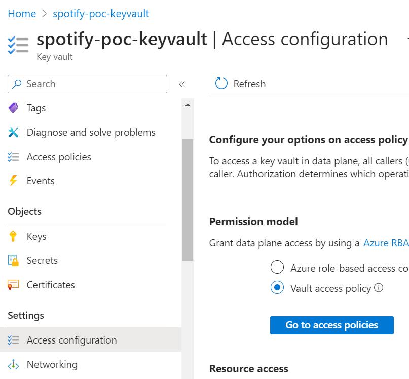
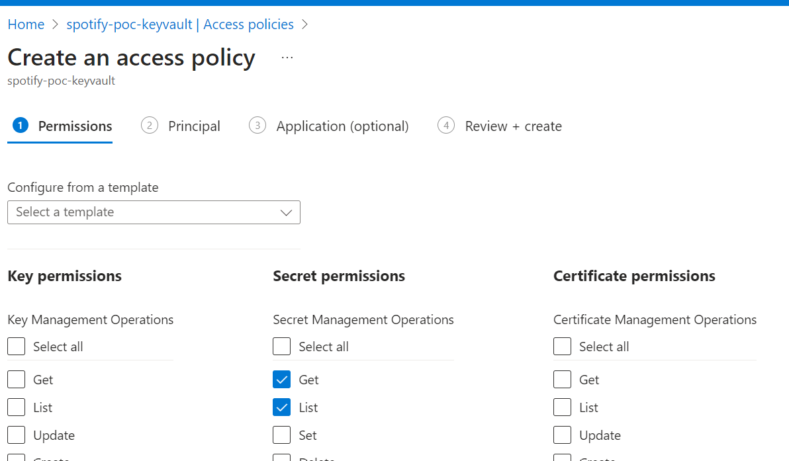
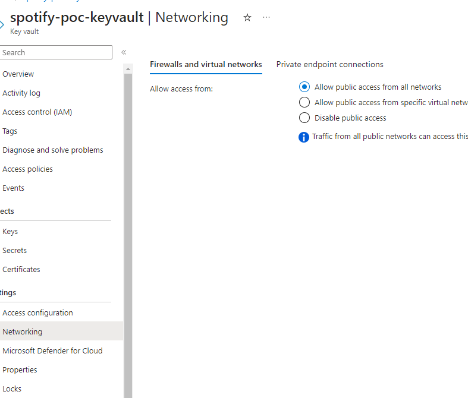
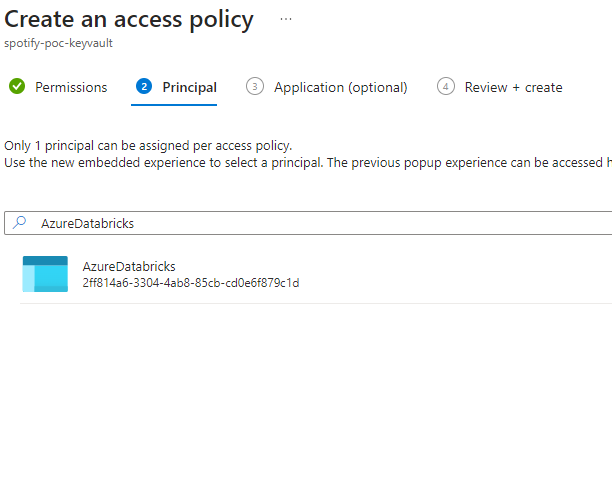

# Setup Databricks Workspace
[Databricks](https://www.databricks.com/) is a unified, open analytics platform that empowers organizations to accelerate innovation through data. It provides a comprehensive suite of tools and services for:

- Data Engineering: Simplify data ingestion, transformation, and orchestration with a unified platform for building data pipelines.
- Data Warehousing: Build scalable and secure data warehouses to support diverse analytical workloads.
- Data Science & Machine Learning: Leverage a unified platform for data exploration, model development, deployment, and management.
- Business Intelligence & Data Visualization: Empower users to explore and analyze data through interactive dashboards and reports.

# Setup Secret Scope in Databricks
Managing secrets begins with creating a secret scope. A secret scope is collection of secrets identified by a name.

To ensure secure and controlled access to sensitive credentials, we leverage Azure Key Vault as our primary storage. To integrate this with Databricks, we follow a two-step process:

- Granting Permission: Firstly, we authorize our Databricks application to access the Azure Key Vault. This ensures secure access and prevents unauthorized data exposure.
- Creating a Secret Scope: Utilizing the Azure Key Vault resource ID and DNS URL, we establish a "secret scope" within Databricks. This serves as a dedicated virtual vault within Databricks, mapping the relevant Azure Key Vault credentials for convenient access and management.

1. Make sure Keyvault Access configuration is set to `Vault access policy`

2. Go to `Access policies` and click on `Create` to create policy. Select `Get`, `List` policy under `Secret Permissions`
  

3. Change Network Settings to allow publi network access
  

4. Serach `AzureDatabricks` service principal 

5. Go to `https://<databricks-instance>#secrets/createScope`. This URL is case sensitive; scope in createScope must be uppercase.

Use the Manage Principal drop-down to specify whether All Users have MANAGE permission for this secret scope or only the Creator of the secret scope (that is to say, you).

Read more about secret scope settings [here](https://learn.microsoft.com/en-us/azure/databricks/security/secrets/secret-scopes)

# Create Databricks Job
1. Access the Workflows section:

- Sign in to your Databricks workspace.
- In the left-hand navigation menu, click on "Jobs" under the "Workflows" section. 

2. Upload the Databricks notebook:

- Click on the "Create Job" button.
- In the job creation wizard, select "Import" as the source for your notebook.
- Click on "Browse" and locate the .dbc file you want to import.
- Choose the desired destination folder within your workspace.
- Click "Import" to upload the notebook file.

3. Configure the Job cluster

4. Review and create the job:

- Review the job details, including the notebook, cluster configuration, and schedule settings.
- If everything is correct, click "Create" to save the job.

