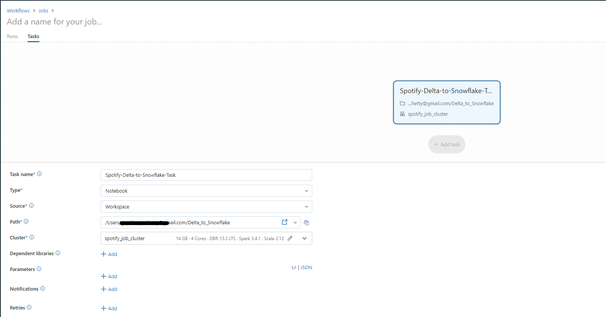
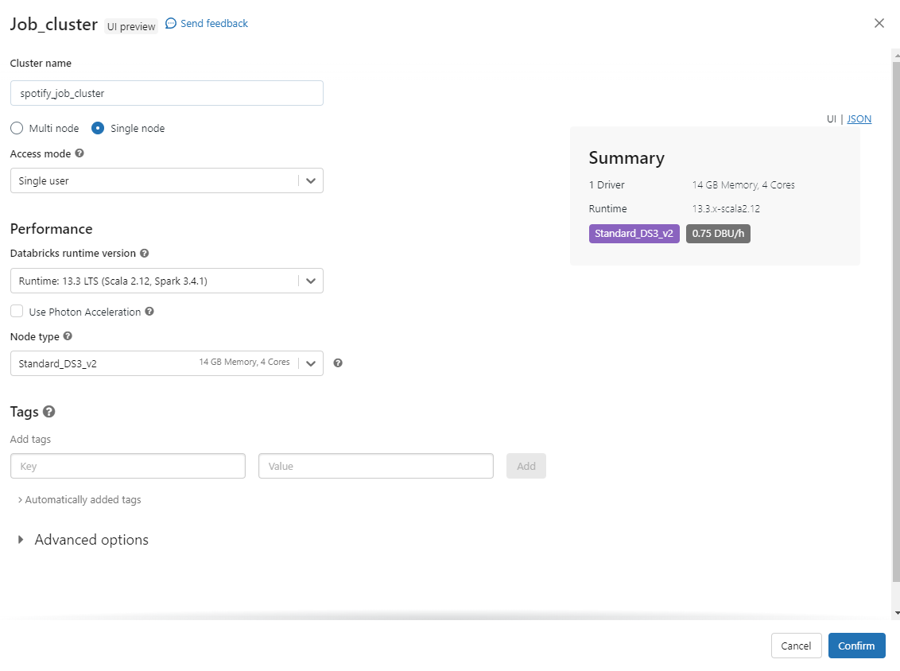

# Setup Databricks Workspace
This document outlines the process for incrementally loading data from a Delta Lake into a Snowflake staging table using Databricks and Airflow. We'll achieve this by:

- **Creating a Databricks notebook** that reads changed records/new records from the Delta Lake, applies transformations, and writes it to the Snowflake staging table.
- **Orchestrating the notebook** as a Databricks job that runs hourly through Airflow.
Leveraging Airflow's scheduler to automate the data pipeline.
This framework ensures automated and reliable ingestion of fresh data from your Delta Lake to Snowflake for further analysis and processing.

# Setup Secret Scope in Databricks
Managing secrets begins with creating a secret scope. A secret scope is collection of secrets identified by a name.

To ensure secure and controlled access to sensitive credentials, we leverage Azure Key Vault as our primary storage. To integrate this with Databricks, we should've assigned permission to databricks and enabled Public Access in Network Settings of KeyVault.

**[Check the steps](https://github.com/abdkumar/spotify-stream-analytics/blob/main/setup/azure.md)**

Go to `https://<databricks-instance>#secrets/createScope`. This URL is case sensitive; scope in createScope must be uppercase. 

**Create scope with name `spotify-secret-scope`**

Read more about secret scope settings [here](https://learn.microsoft.com/en-us/azure/databricks/security/secrets/secret-scopes)

# Required Secrets in KeyVault

| Variable | Description | Example Value |
|---|---|---|
| `sfURL` | URL of your Snowflake account | https://<YOUR ACCOUNT\>.snowflakecomputing.com |
| `sfAccount` | Snowflake Account Name part from snowflake URL | <YOUR ACCOUNT\> |
| `sfUser` | Username for your Snowflake account | <YOUR_USER_NAME> |
| `sfPassword` | Password for your Snowflake account | <YOUR_SNOWFLAKE_PASSWORD> |
| `sfSchema` | Name of the schema withina given database you want to access | test |
| `sfDatabase` | Name of the database you want to access | dev_spotify_data |
| `sfWarehouse` | Name of the warehouse you want to use | my_warehouse |
| `sfRole` | Name of the role to assume for access control | stagingrole |
| `dbtable` | Name of the Snowflake table you want to interact with | staging_events |
| `adls-account-key` | Accout Key of ADLS Storage Account| <ACCOUNT KEY\> |
| `adls-account-name` | ADLS Storage Account Name| <ACCOUNT NAME\> |
| `adls-container-name` | Container Name where spark processed delta lake is stored | <CONTAINER NAME\> |
| `adls-folder-path` | Give the folder path where spark processed delta lake is stored| <FOLDER PATH\> |

Make sure the Snowflake configuration is matched with **[Snowflake Workspace](https://github.com/abdkumar/spotify-stream-analytics/blob/main/setup/snowflake.md)**

Make sure the ADLS configuration is matched with **[Spark Streaming Configuration](https://github.com/abdkumar/spotify-stream-analytics/blob/main/setup/spark.md)**

# Create a Databricks Job
We'll cover uploading the notebook, creating a single-node cluster, reviewing the code, and launching the job.

### 1. Upload the Notebook:

1. Access your Databricks workspace.
2. Navigate to the Workspace pane and click on Notebooks.
3. Click on Import.
4. Select From Git URL and paste the URL of the notebook: https://github.com/abdkumar/spotify-stream-analytics/tree/main/cdc
5. Select the .dbc file and click Import.

The notebook will be imported into your Databricks workspace.

### 2. Create a Cluster:

1. Click on Clusters in the Workspace pane.
2. Click on Create Cluster.
3. Choose a Cluster Name and select Single Node.
4. Under Node Type, choose StandardDS3_v2 (14 cores, 320 GB RAM).
5. Leave the default options for the remaining settings and click Create Cluster.

A single-node cluster with the specified resources will be created for running your job.

### 3. Review and create the job:
 - Review the job details, including the notebook, cluster configuration, and schedule settings.
 - If everything is correct, click "Create" to save the job.

## Delta Lake Incremental Data Processing
This section explains the key steps within your Databricks notebook for incrementally loading new data from a Delta Lake to a Snowflake staging table:

**1. Reading Delta Table and Identifying New Data:**
- Import the Delta Package: Utilize the delta package within your Python code to access and manipulate the Delta table.
- Checkpoint File Check:
  - Check for the existence of a checkpoint file. This file stores the timestamp of the last processed data batch.
  - If the file exists, read the timestamp from it.
  - If the file doesn't exist, it's the first run:
- Find the maximum commit timestamp from the Delta table history.
- Set this timestamp as the `LAST_READ_TIMESTAMP` variable.

**2. Incremental Data Processing:**

- Read Delta Table: Utilize the spark.read.format("delta") command to read the Delta table, specifying the startTimestamp parameter.
- Set Start Timestamp: Use the `LAST_READ_TIMESTAMP` as the startTimestamp value. This ensures you only read data committed after the last successful run.
- Data Processing: Apply your desired transformations and cleaning operations to the DataFrame containing the new data.

**3. Writing to Snowflake and Updating Checkpoint:**

- Write to Snowflake: Write the processed DataFrame to the Snowflake staging table using the spark.write.format("snowflake") command.
- Update Checkpoint File: Write the current timestamp (indicating the end of the processed data batch) to the `checkpoint` file. This timestamp will be used as the startTimestamp for the next run.

# Secure Databricks Access for Airflow with Key Vault

- **Generate Databricks Token** Log in to your Databricks workspace, go to `Settings > Access Control > Personal Access Tokens` and create a token. Copy and securely store this token! You won't be able to view it again after generating.

- **Create Key Vault Secrets**:
  - **Databricks Access**: In Key Vault, create a secret named `airflow-connections-databricks-secret` with value: `databricks://@<workspace-host>?token=<api-token>`.
  
    Example: `databricks://@adb-123455151858115484.4.azuredatabricks.net?token=dapi11kkededsad23b3bc09d14dc5mdakmdwqjdf2ijf-3`
  - **Databricks Job ID**: After creating your Databricks job, retrieve its ID and create another secret named `databricksJobID` with the Job ID as its value.

- **Use Secrets in Airflow:**
  - **Databricks Connection**: Reference the `databricks-secret` (prefix is automatically removed as we have set secret backend kwargs)for the Databricks connection URI.
  - **Databricks Job ID**: Access the job ID from the `databricksJobID` within your Airflow DAG for further processing or monitoring.

<i>This safely stores both your Databricks access token and job ID in Key Vault, keeping your Airflow code clean and secure. Enjoy automated dataflows with easily accessible job information!</i>

