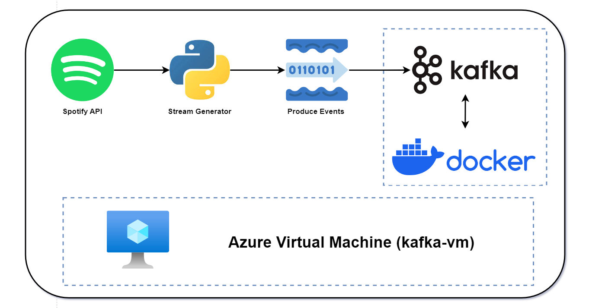

# Setup Kafka VM
We will setup Kafka and data generator in a dedicated compute instance. Python Data Generator script will communicate with port 9092 of the broker container of Kafka to send/produce sptofy stream events.



- Establish SSH connection
SSH into the VM using username and public ip address
```bash
ssh user@ipaddress
```

- Clone git repo and cd into Kafka folder
```bash
sudo apt update && \
sudo apt install git && \
git clone https://github.com/abdkumar/spotify-stream-analytics.git
```

- Install docker & docker-compose
```bash
bash ~/spotify-stream-analytics/scripts/vm_setup.sh && \
exec newgrp docker
```
- Check Docker Installation
```bash
docker version && \
docker compose version
```

- Set environment variable, External IP of the Kafka VM

```bash
export KAFKA_BROKER_ADDRESS=IP.ADDRESS
```
- Set environment variable, Kafka Topic Name of your interest (Ex: spotify)
```bash
export KAFKA_EVENTS_TOPIC=TOPIC_NAME
```

- Start Kafka
```bash
bash ~/spotify-stream-analytics/scripts/kafka_setup.sh && \ 
docker ps
``` 
**Note**: In case `docker ps` is not showing `kafka` and `zookeeper` containers. You should just stop all the containers with `docker compose down` and then rerun bash script.

- The Kafka Control Center should be available on port 9021. Open and check if everything is working fine.

- Open another terminal session for the Kafka VM and start sending messages to your Kafka broker with python script

- export spotify api
- Install python packages
```python
python -m pip install -r ~/spotify-stream-analytics/requirements.txt
```
- change the directory 
```bash
cd ~/spotify-stream-analytics/data
```

- Update stream generation configuration `config.yml`

- Run `main.py` which generates spotify stream events
```python
python main.py
```

SPOTIPY_CLIENT_ID = os.environ.get("SPOTIPY_CLIENT_ID")
SPOTIPY_CLIENT_SECRET = os.environ.get("SPOTIPY_CLIENT_SECRET")


