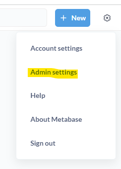
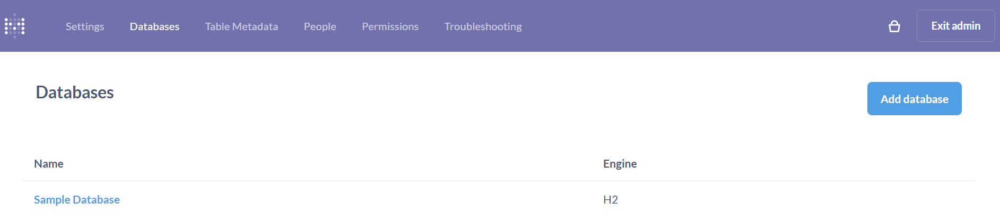
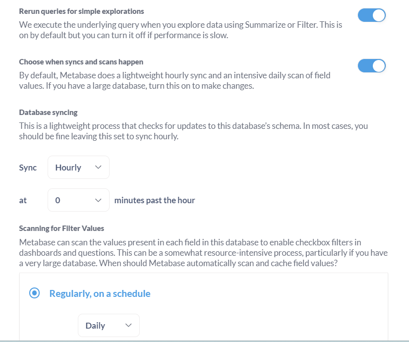
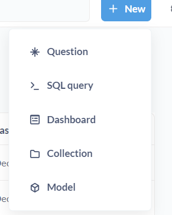

# Setup Metabase
[Metabase](https://www.metabase.com/) is an open-source business intelligence (BI) platform that empowers users to explore and analyze data without relying on technical expertise. It provides a user-friendly interface for data visualization, allowing everyone in an organization to gain valuable insights from their data.

# Install Metabse in local using Docker
Metabase provides an official Docker image via Dockerhub that can be used for deployments on any system that is running Docker.

Start Docker Engine (open docker application) and Pull the latest image by running the following command in VS Code/CMD

```
docker pull metabase/metabase:latest
```

Then start the Metabase container:
```
docker run -d -p 3000:3000 --name metabase metabase/metabase
```

You should be able to launch the site by navigating to http://localhost:3000 in your web browser.<br>
Upon accessing the site, you'll be prompted to complete a registration form, requiring information such as your username, email address, and password.

# Add Snowflake Connection
Go to admin settings in the top right side<br>
 <br>

Go to database section and `Add database`


Select Snowflake database type, add all the details like username, password, warehouse (Uppercase), database (Uppercase), schema (Uppercase), role (Uppercase) etc.

Also in advanced options enable auto-sync


once database is added go to database section and verify it. 
Exit the admin page (Top right)

# Collection, Dashboard and Questions

Metabase organizes your data and analysis into three key components: collections, dashboards, and questions. Each plays a crucial role in enabling efficient data exploration and visualization.

#### Collections:

Act as organizational units for grouping related dashboards and questions.
Offer flexible access control, allowing you to restrict who can view and edit the contents.
Facilitate collaboration by sharing specific collections with team members.
Promote a clean and organized workspace for managing your data analysis projects.

#### Dashboards:

Serve as visual reports, bringing together multiple related questions in a single interface.
Allow you to combine different types of visualizations (e.g., charts, tables) for comprehensive data analysis.
Provide interactive features like filtering and drilling down, allowing users to explore data in greater depth.
Can be customized to meet specific needs and preferences, including branding and layout.

#### Questions:

Represent the building blocks of data analysis, formulated as SQL queries to retrieve and transform data.
Can be simple or complex, focusing on specific data points or incorporating advanced calculations.
Once created, questions can be reused in various dashboards and collections.
Offer flexibility in analyzing data from different perspectives and creating tailored reports.

#### How they work together:

- Collections: Organize and manage your questions and dashboards.
- Dashboards: Combine related questions to present a holistic view of data.
- Questions: Form the foundation for analysis, retrieving and manipulating data.

By understanding these key components, you can leverage Metabase effectively to explore and analyze your data, leading to insightful discoveries and informed decision-making.

#### Additional Tips:

Start by creating collections to categorize your data analysis projects.
Build individual questions to address specific data points or trends.
Combine relevant questions into dashboards for comprehensive data exploration.
Leverage the interactive features of dashboards to gain deeper insights.
Utilize collections to manage access control and collaborate efficiently.

Click on New to create collection, Dashboard or questions <br>


# Creating a Question
Go through [this link](https://www.metabase.com/docs/latest/questions/query-builder/introduction) to add questions/KPIs of your interest<br>

# Adding question to Dashboard
Go through [this link](https://www.metabase.com/docs/latest/dashboards/introduction#adding-saved-questions-to-a-dashboard) to add saved questions to Dashboard.