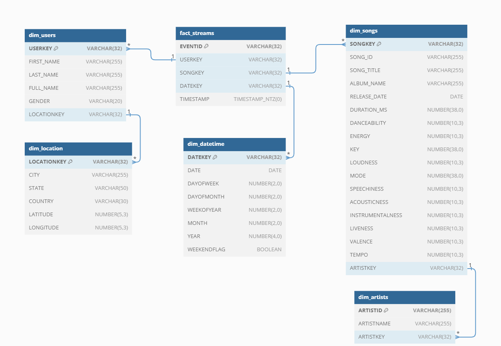

# Setup Snowflake Account

Get Started with Snowflake
1. Sign Up for a Free Trial: Head to the [Snowflake website](https://signup.snowflake.com/) and create a free trial account.
2. Choose Your Edition: Select the Standard Edition with Azure backend.
3. Activate Your Account: Check your email for the account activation link and log in.


# Create Staging Table to store raw event streams
Using snowflake worksheet create database, schema and staging table
```sql
---> set Role Context
USE ROLE accountadmin;

---> set Warehouse Context
USE WAREHOUSE compute_wh;

---> create the Database
CREATE DATABASE IF NOT EXISTS dev_spotify_data;

---> create the Schema
CREATE SCHEMA IF NOT EXISTS dev_spotify_data.test;


---> create the Table
CREATE TABLE IF NOT EXISTS dev_spotify_data.test.staging_events (
  first_name  VARCHAR(255) NOT NULL,
  last_name   VARCHAR(255) NOT NULL,
  gender      VARCHAR(20) NOT NULL,
  city        VARCHAR(255) NOT NULL,
  state       VARCHAR(50) NOT NULL,
  country     VARCHAR(30) NOT NULL,
  latitude    DECIMAL(5,3) NOT NULL,
  longitude   DECIMAL(5,3) NOT NULL,
  listen_timestamp BIGINT NOT NULL,
  song_id     VARCHAR(255) NOT NULL,
  artist_name  VARCHAR(255) NOT NULL,
  artist_id   VARCHAR(255) NOT NULL,
  song_title  VARCHAR(255) NOT NULL,
  album_name  VARCHAR(255) NOT NULL,
  release_date DATE NOT NULL,
  duration_ms  BIGINT NOT NULL,
  danceability  DECIMAL(10,3) NOT NULL,
  energy       DECIMAL(10,3) NOT NULL,
  key          INT NOT NULL,
  loudness    DECIMAL(10,3) NOT NULL,
  mode         INT NOT NULL,
  speechiness   DECIMAL(10,3) NOT NULL,
  acousticness  DECIMAL(10,3) NOT NULL,
  instrumentalness DECIMAL(10,3) NOT NULL,
  liveness     DECIMAL(10,3)NOT NULL,
  valence      DECIMAL(10,3) NOT NULL,
  tempo        DECIMAL(10,3) NOT NULL,
  year         INT NOT NULL,
  month        INT NOT NULL,
  hour         INT NOT NULL,
  day          INT NOT NULL,
  duration_minutes DECIMAL(20,3) NOT NULL,
  full_name    VARCHAR(255) NOT NULL
    --> supported types: https://docs.snowflake.com/en/sql-reference/intro-summary-data-types.html
    )
    COMMENT = 'staging table for storing raw spotify stream events';

---> query the empty Table
SELECT * FROM dev_spotify_data.test.staging_events;
```
# Create Stream for Change Data Capture (CDC)
Refer: https://docs.snowflake.com/en/sql-reference/sql/create-stream

Create a Snowlfke Stream on staging table to track the changes
```sql
CREATE OR REPLACE STREAM dev_spotify_data.test.staging_stream ON TABLE dev_spotify_data.test.staging_events;

SELECT * FROM dev_spotify_data.test.staging_stream;
```

-------------------------------------------------------------------------------------------

# Create Roles to manage access
we are creating 2 roles <br>
a. **staging_role** - 
Databricks reads changed Delta Lake records into a staging table with limited access via a dedicated "staging role" for enhanced data security. <br>
b. **dev_role** - In order to facilitate the development and updates of dimension and fact tables within the DEV_SPOTIFY_DATA.TEST schema utilizing the dbt data warehouse transformation tool, a dedicated role named "dev_role" is being created, granting full access to all tables within the selected schema.

<i>creating staging_role (for cdc):</i><br>
give database, schema, tables and stage (databricks creates temporary stage to ingest records into snowflake table) access to stagingrole
```sql
CREATE ROLE stagingrole;
GRANT ROLE stagingrole TO USER kumar; # replace username here 
GRANT USAGE ON WAREHOUSE compute_wh TO ROLE stagingrole;
GRANT USAGE ON DATABASE dev_spotify_data TO ROLE stagingrole;
GRANT USAGE ON SCHEMA dev_spotify_data.test to ROLE stagingrole;
GRANT SELECT, INSERT ON TABLE dev_spotify_data.test.staging_events TO ROLE  stagingrole;
GRANT SELECT ON ALL TABLES IN SCHEMA dev_spotify_data.test TO ROLE stagingrole;
GRANT CREATE STAGE ON SCHEMA dev_spotify_data.test TO ROLE stagingrole;
```
<br>

<i>creating dev_role (for dbt transformations):</i> <br>
give database, schema, tables and stream access to dev_role
```sql
CREATE OR REPLACE ROLE dev_role;
GRANT ROLE dev_role TO USER kumar; # replace username here 
GRANT USAGE ON WAREHOUSE compute_wh TO ROLE dev_role;
GRANT USAGE ON DATABASE dev_spotify_data TO ROLE dev_role;
GRANT USAGE ON SCHEMA dev_spotify_data.test TO ROLE dev_role;
GRANT ALL PRIVILEGES ON SCHEMA dev_spotify_data.test  TO ROLE dev_role;
GRANT ALL PRIVILEGES ON FUTURE TABLES IN SCHEMA dev_spotify_data.test  TO ROLE dev_role;
GRANT ALL PRIVILEGES ON ALL TABLES IN SCHEMA dev_spotify_data.test  TO ROLE dev_role;
GRANT SELECT ON ALL TABLES IN SCHEMA dev_spotify_data.test TO ROLE dev_role;
GRANT CREATE STAGE ON SCHEMA dev_spotify_data.test TO ROLE dev_role;
GRANT SELECT ON STREAM dev_spotify_data.test.staging_stream TO ROLE dev_role;
```

# Data Modelling
This section outlines the data warehouse modeling approach and transformation process. We aim to build a robust and scalable data warehouse optimized for efficient data analysis and reporting.

Data Modeling and Transformation
This section outlines the data warehouse modeling approach and transformation process. We aim to build a robust and scalable data warehouse optimized for efficient data analysis and reporting.

### Data Model Overview:

The data model is structured using dimensions, facts, and relationships:

- **Dimensions**: Represent entities like users, songs, artists, location, and dates.
- **Facts**: Contain measurements associated with dimensions, song stream events.
- **Relationships**: Define links between dimensions and facts.

Utilizing the dbt tool, we incrementally transform data from staging tables into optimized fact and dimension tables. 
This process includes:

- **Data cleaning**: Identifying and correcting data inconsistencies.
- **Data transformation**: Applying business logic and calculations to format and enrich data.
- **Data partitioning**: Optimizing data organization for faster query performance


