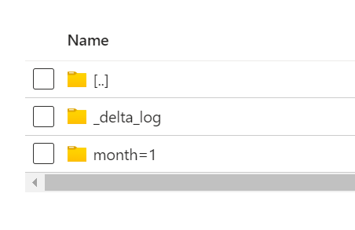
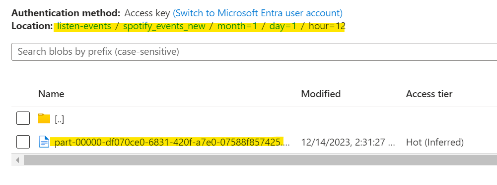

# Setup Spark Streaming Job
This document guides you through the key steps of setting up a Spark streaming job to process Spotify stream events from Kafka and write them to an ADLS Delta table with incremental updates to Snowflake.

## Key Steps
### 1. Environment Configuration:
- Ensure environment variables for Kafka address, port, topic name, ADLS storage account name, account key, container name, and folder path are set in a .env file.
- This facilitates secure and modular configuration management.

### 2. Spark Session and Dependencies:
- Create a Spark session with appropriate configurations.
- Install required Spark packages for streaming, DataFrame operations, and ADLS access using `spark-submit` or PySpark library calls.

### 3. Kafka Stream Reader:
- Define a read stream instance that connects to the specified Kafka broker and subscribes to the designated topic.
- This stream will continuously receive new Spotify stream events as they are produced.

### 4. Stream Processing:
Within the processing logic of the streaming job:
- Extract date and time features from the timestamp field.
- Calculate duration in minutes from duration_ms.
- Round latitude and longitude values to 3 decimal places.
- Combine first and last names to create a full name.

### 5. ADLS Delta Table Creation:
- Create an empty Delta table in the specified ADLS location.
- Define an appropriate schema and partition columns (month, day, hour).
- Enable change data capture (CDC) on the Delta table for incremental updates.

### 6. Append Stream Writes:

- Configure a write stream for the processed stream, writing in append mode to the Delta table.
- Specify partition columns (month, day, hour) to organize data efficiently.
- Set a processing time interval of 120 seconds (2 minutes) to trigger micro-batch processing and writes to ADLS.

### 7. Checkpointing and Monitoring:

- Utilize a checkpoint directory within a spark_streaming directory to track the last consumed offset from Kafka.
- This ensures fault tolerance and enables resuming the stream from the last processed event in case of interruptions.

### 8. Snowflake Integration:
- In a subsequent step of your pipeline (not covered here), you can leverage the CDC capabilities of the Delta table to incrementally read processed data and ingest it into your Snowflake warehouse for further analysis and reporting.

### Benefits:

- Real-time processing of Spotify stream events with Spark Streaming.
- Efficient data storage and incremental updates using Delta tables in ADLS.
- Granular control over data partitioning and write frequencies.
- Fault tolerance and checkpointing for reliable stream processing.


# Running the Spark Streaming Job
This section details how to launch your Spark streaming job for processing Spotify stream events.

### 1. Verify Public IP and SSH Connection:

- Confirm the updated public IP: Check your cloud provider's console or prior setup instructions to find the most recent public IP address assigned to the Kafka VM.
- Establish an SSH connection: Use a terminal application and your SSH key to connect to the VM (`kafka-vm`) using the confirmed public IP address.
```bash
ssh username@ipaddress
```

### 2. Check Spark Installation:
Run `pyspark --version` command to verify the installation of pyspark & spark. <br>
If spark is not installed then run the shell script
```bash
bash  ~/spotify-stream-analytics/scripts/spark_setup.sh
```

### 3. Required Environment Variables
Make sure `.env` file has the following env variables set

- **`KAFKA_BROKER_ADDRESS`**: Specify the hostname or IP address of your Kafka broker (e.g., ip addrees/localhost).
- **`KAFKA_BROKER_PORT`**: Define the port used by your Kafka broker (e.g. 29092).
- **`KAFKA_EVENTS_TOPIC`**: Assign a name for the topic to publish Spotify stream events (e.g., spotify).
- **`ADLS_STORAGE_ACCOUNT_NAME`**: Name of the ADLS Storage Account.
- **`ADLS_ACCOUNT_KEY`**: Account Key of the Storage Account (check in Azure Portal > ADLS > Properties section).
- **`ADLS_CONTAINER_NAME`**: Name of the container in ADLS.
- **`ADLS_FOLDER_PATH`**: Folder Path in ADLS, where we want to store processed data.


### 4. Navigate and Submit Spark Job:

- Change directory: Within the VM, navigate to your Spark code directory: 
```bash
cd  ~/spotify-stream-analytics/spark_streaming/
```

- Submit the Job
```python
spark-submit --packages org.apache.spark:spark-sql-kafka-0-10_2.12:3.5.0,io.delta:delta-spark_2.12:3.0.0,io.delta:delta-core_2.12:2.4.0,org.apache.hadoop:hadoop-azure:3.3.6,org.apache.hadoop:hadoop-azure-datalake:3.3.6,org.apache.hadoop:hadoop-common:3.3.6 stream_events.py
```

### 5. Verify Job Output:

- If your Spark job runs successfully, you should see Delta Parquet files created in the specified folder within your Azure ADLS Gen2 storage account.
- Look for files with names matching your Delta table schema and partition columns.



This confirms that your job is processing and writing data correctly to the desired location.